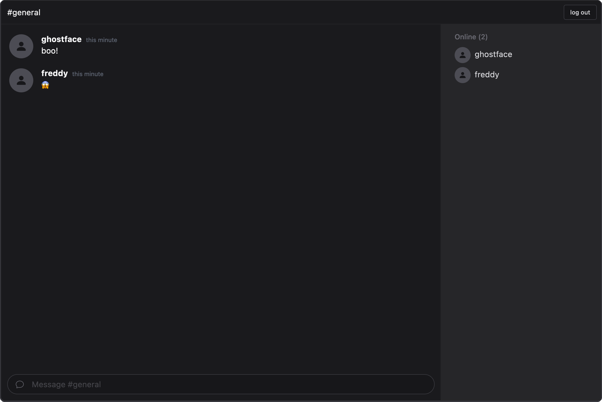

# WIP lit-gundb-chat-demo



TODO:

- [ ] Encrypted messages
- [ ] Multiple rooms
- [ ] Private messages

## Quickstart

Install dependencies:

```sh
yarn
```

Start the dev server:

```sh
yarn serve
```

This will open a new tab in your default to localhost:8000.

## Scripts

- `serve` runs your app for development, reloading on file changes
- `start` runs your app after it has been built using the build command
- `build` builds your app and outputs it in your `dist` directory
- `test` runs your test suite with Web Test Runner
- `lint` runs the linter for your project

## Tooling configs

For most of the tools, the configuration is in the `package.json` to reduce the amount of files in your project.

If you customize the configuration a lot, you can consider moving them to individual files.
